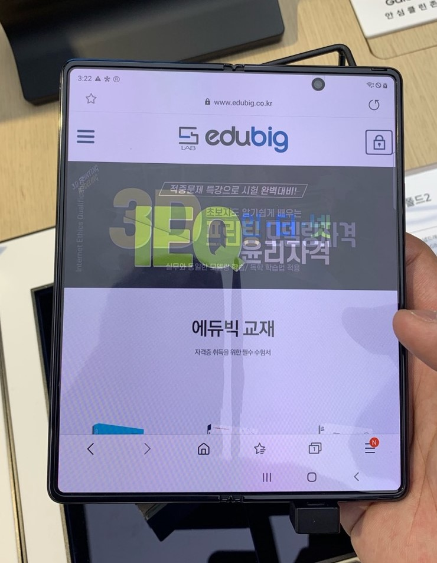
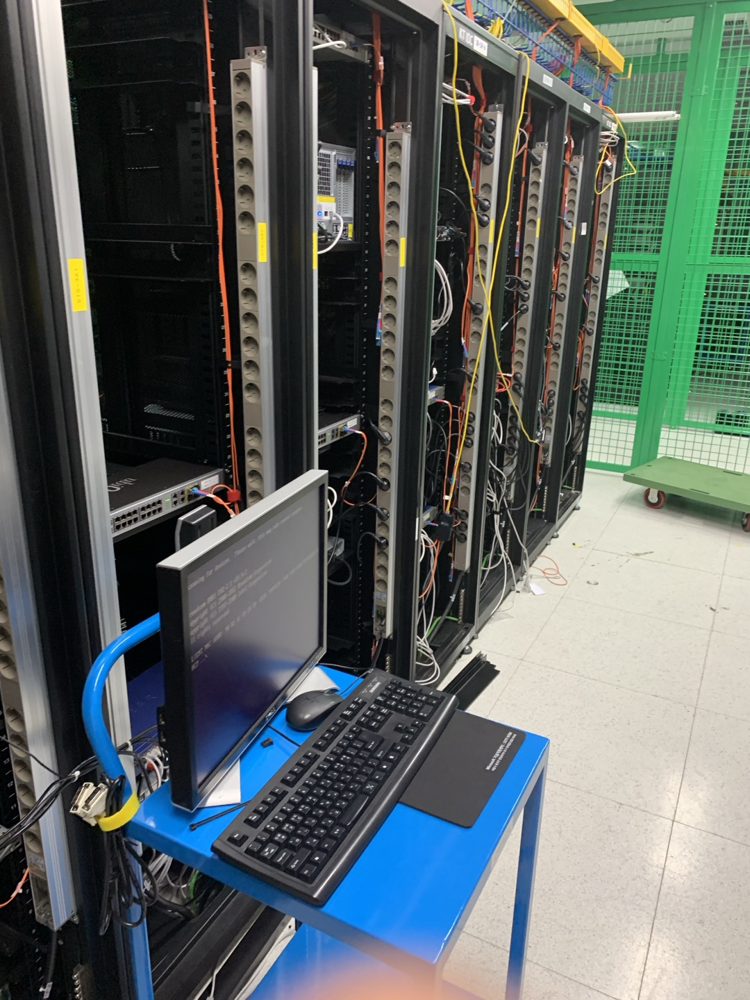
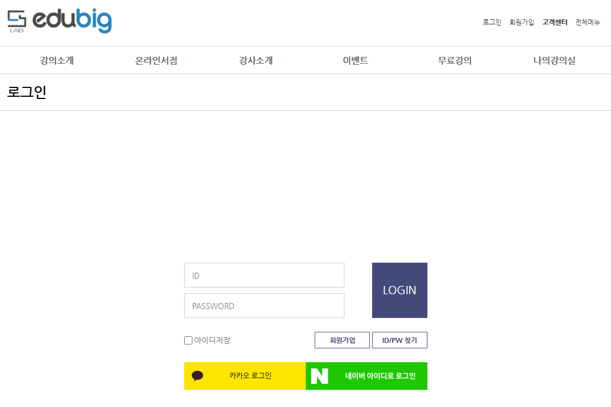
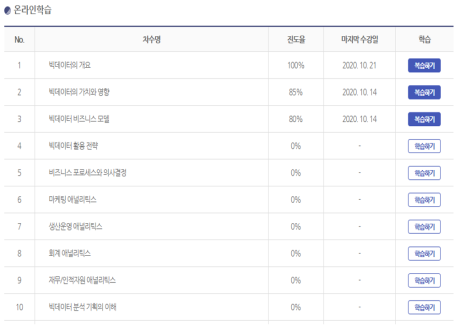

\* 보안 이슈로 관리자 페이지 및 일부 코드는 제외하였습니다.

 

## 프로젝트 개요 
### Subject
EDUBIG 온라인 민간자격증 LMS 교육사이트

### About
경영빅데이터분석사, IEQ인터넷윤리지도사, 3D프린팅모델링 등의 서비스를 제공하는 

Maven + Spring Framework 기반 교육사이트

### Duration
2021.01 ~ 2021.06

 

## 기술 스택
### Environment

### Framework

### WAS

### Development

### IDE

### Social Login

 

## 프로젝트 주요 사항

- 가산 IDC에 4U 랙 마운트 및 도메인 연결
- WAS(Tomcat)와 DB(Oracle) 서버 연동 (운영 서버)
- Maven + Spring MVC 구축 및 백엔드 개발
- 회원가입, 로그인, 게시판, 기간제 이벤트, 교육 시스템, 올앳 결제, SSL 등 다양한 기능 지원
- 교육 콘텐츠 재생을 위해 자체 개발한 HLS Streaming Player 탑재
- MyBatis를 연동하여 사용자 진도 체크, 결제 이력 등 쿼리 작성
- 반응형 웹 지원 (상단 사진 참고)

 

가산 IDC에서 직접 4U 랙 설치 후 도메인을 구매하여 연결했습니다. 1차 개발 후 WAS에 Sectigo RSA SSL 보안인증서를 설정했습니다.

 

네이버, 카카오를 이용한 소셜 로그인 기능을 제공을 통해 UX를 개선하였습니다.

 

LMS 시스템 설계를 위한 입과 정책 및 진도 체크 등을 Oracle 쿼리와 트리거로 구현했습니다.

 

## 프로젝트 소감

사내에서 처음 팀장직을 맡으며 진행했던 첫 프로젝트인만큼 팀원들 각자의 전문성을 최대한
살리고 원활한 협업을 위해 노력했습니다. 

현재는 서비스되고 있지 않지만, 약 2년 동안 서비스하며 많은 이용자들이 교육 이수를 통해
민간자격증을 발급받은 것으로 알고 있습니다. 

팀장으로서 애착을 갖고 기획 단계부터 타 브랜드 벤치 마킹을 하며 시작해, 결제와 SSL 등
다양한 기술 지원을 바탕으로 교육 사이트를 서비스한 소중한 경험으로 남아있습니다.